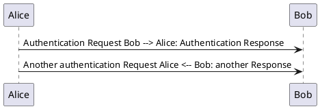

# Filter Tests

## This is a Mermaid Diagram

~~~mermaid {width=20em}
flowchart LR
  A["Does UTF-8 work? äöü"] --> B
  B --> C
  C --> A
~~~

## This is a PlantUML Diagram

~~~plantuml
@startuml
class Object << general >>
Object <|--- ArrayList

note top of Object : In java, every class\nextends this one.

note "This is a floating note" as N1
note "This note is connected\nto several objects." as N2
Object .. N2
N2 .. ArrayList

class Foo
note left: On last defined class
@enduml
~~~

# $\TeX$ Tests

## This is some math

\begin{gather*}
3x^2 = y
\end{gather*}

\begin{gather*}
y =
\begin{pmatrix}
1 & 2 & 3 \\
a & \pi & 4 \\
5 & 1 % m
\end{pmatrix}
\end{gather*}

And does Inline Math work? Test: $5x^3 = \frac{\pi}{3}$ Did it work?

