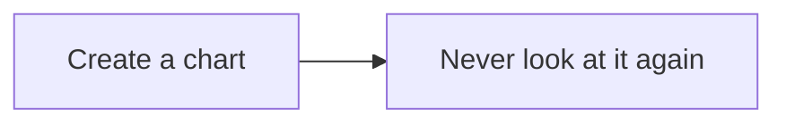

# pandoc-all-in-one

All-in-one Docker image for [`pandoc`](https://pandoc.org/) (see [goals](#goals)) including:
  - custom bundled filters:
    - [**Mermaid Filter**](https://mermaid.js.org/)
    - a filter for including external files in your document
    - (it is planned to bundle some lua filters from the lua-filters repository, e.g. the [diagram filter](https://github.com/pandoc/lua-filters/tree/master/diagram-generator))
  - pre-installed dependencies:
    - **TeXLive**
    - wkhtmltopdf
    - librsvg, ghostscript
  - utilities for your working environment:
    - `--watch` flag for the pandoc command, keeping the process alive and recompiling on changes

*This image is work in progress.*

## Installation

To use this image just run

with [**Podman**](https://podman.io/)
```bash
podman run --rm -it -v "$(pwd):/data:z" jakobkmar/pandoc-all-in-one
```

with [**Docker**](https://www.docker.com/)
```bash
docker run --rm -it -v "$(pwd):/data" jakobkmar/pandoc-all-in-one
```

To shorten that process, create an [`alias`](https://man7.org/linux/man-pages/man1/alias.1p.html) (`alias pandoc='...'`).

## Filters

### Mermaid Diagrams

To use the mermaid filter, create a code block like this

```pandoc
~~~{.mermaid width=350}
flowchart LR
  A["Create a chart"] --> B["Never look at it again"]
~~~
```
All parameters after `.mermaid` are optional.

Result:


### Include files

To include external files, you can also use a code block
```pandoc
~~~{include="my_file.c"}
This is the placeholder for an external file.
~~~
```
Optionally, you can specify the language explicitly using `.lang` before the include parameter.

## Flags

The following flags are available:
- `--watch` - the process will keep running, if you write a new change to document pandoc will be rerun

## Goals

This project aims to provide an extremely effortless distribution of pandoc, which has:
- all necessary dependencies pre-installed
- commonly used filters pre-applied
- utilities for the development environment of your document included
- use LaTeX math whenever you need it

You should be able to create a markdown file, just run one command and have an editor, live preview and the actual output all available in seconds.
This allows you to take notes quickly, create presentations using the `-t beamer` flag and visualize your thoughts on the fly in graphs, and more!
And all of this using the editor of your choice - no more random online editors.

## Planned

More features are planned, for example:
- bundle more filters
- add more command line utilities like opening a full environment for working with your input file and viewing the rendered output in real time
- make the mermaid filter more reliable
- convert SVGs with Inkscape when the target document is a PDF, since it has better conversion in certain scenarios
